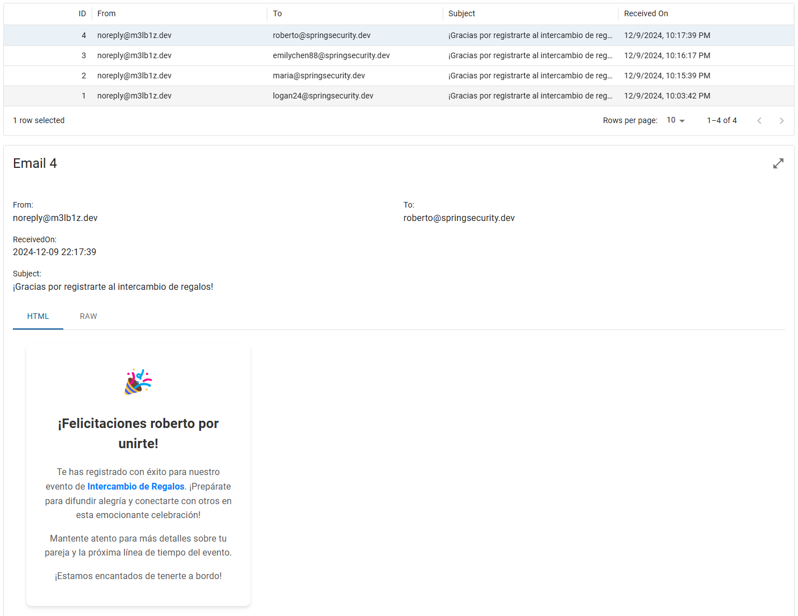
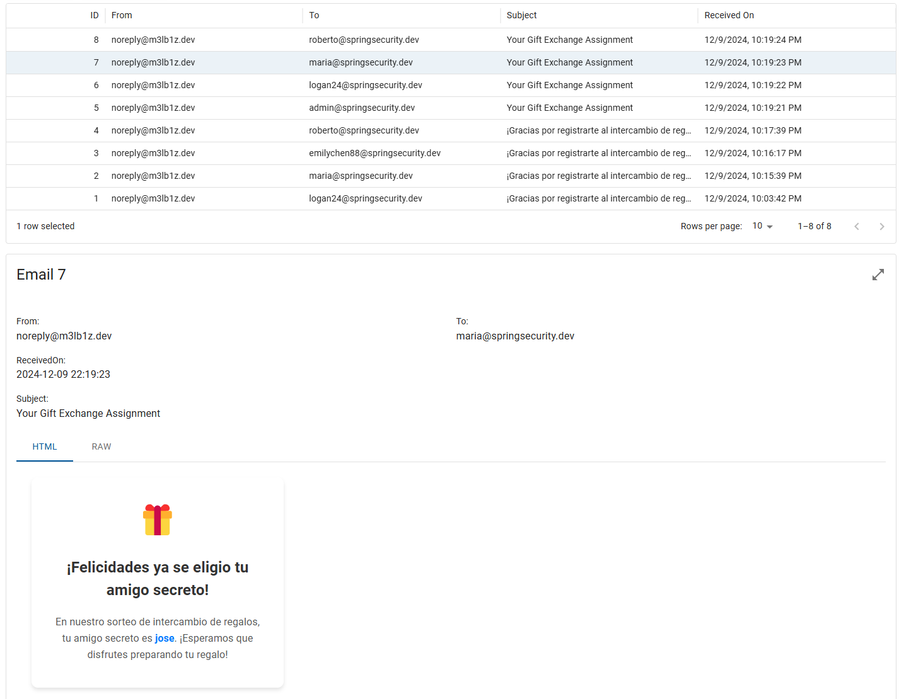

# Gift Exchange API


## Descripción

La **Gift Exchange API** es una aplicación diseñada para facilitar el intercambio de regalos durante la temporada de Nochebuena. Permite a los usuarios registrarse, autenticarse, y participar en el sorteo de destinatarios de regalos. La API está construida con **Spring Boot** y utiliza **Spring Security** para la autenticación y autorización, **Swagger** para la documentación interactiva, **PostgreSQL** como base de datos, **Flyway** para la gestión de migraciones de base de datos, **JavaMail** para el envío de correos electrónicos y **JWT** para la autenticación basada en tokens.

## Características

- **Registro y Autenticación de Usuarios**: Permite a los usuarios registrarse y autenticarse en la plataforma.
- **Gestión de Participantes**: Los usuarios pueden registrarse como participantes del intercambio de regalos.
- **Asignación Aleatoria de Destinatarios**: Asigna aleatoriamente destinatarios de regalos a los participantes.
- **Visualización de Asignaciones**: Los participantes pueden ver a quién deben regalarle.
- **Documentación Interactiva**: Utiliza Swagger para proporcionar una documentación interactiva de la API.

## Endpoints Principales

### Autenticación

- **POST** `/auth/register`: Registrar un nuevo usuario.
- **POST** `/auth/login`: Iniciar sesión con un usuario existente.

### Participantes

- **POST** `/participants/register`: Registrar un nuevo participante.
- **GET** `/participants/assigned`: Obtener el participante asignado para el regalo.

### Asignaciones

- **POST** `/assignments`: Asignar destinatarios de regalos aleatoriamente.
- **GET** `/assignments/list`: Listar todas las asignaciones de regalos.

## Tecnologías Utilizadas

- **Java 21**
- **Spring Boot** para el desarrollo de la aplicación.
- **Spring Security** para la autenticación y autorización.
- **Swagger** para la documentación de la API.
- **PostgreSQL** como base de datos.
- **Flyway** para la gestión de migraciones de base de datos.
- **JavaMail** para el envío de correos electrónicos.
- **JWT** para la autenticación basada en tokens.

## Requisitos

- **Java JDK 21**
- **Maven 3**
- **PostgreSQL 14**

## Pasos para ejecutar el proyecto

1. **Instalar las dependencias** necesarias.

   Asegúrate de tener instalados Java JDK 21, Maven 3 y PostgreSQL 14.

2. **Configurar la base de datos**.

   Crea una base de datos en PostgreSQL y actualiza las credenciales en el archivo `application.properties`.

3. **Construir el proyecto** con Maven.

   ```sh
   mvn clean package
   ```

4. Ejecutar el JAR generado.

   ```sh
   java -jar target/gitfexchange.jar
   ```

5. **Acceder a la documentación de la API** en `http://localhost:8080/swagger-ui.html`.

## Documentación de la API

La API proporciona puntos finales para gestionar el intercambio de regalos. A continuación se muestran los puntos finales disponibles y sus formatos de solicitud/respuesta esperados.

[Documentación Gift Exchange API](https://m3lb1z.github.io/challenge-present-exchange/)

## Ejemplos del envio de mensajes

A continuación se muestran ejemplos de la plantilla de mensaje configurado por JavaMail:




